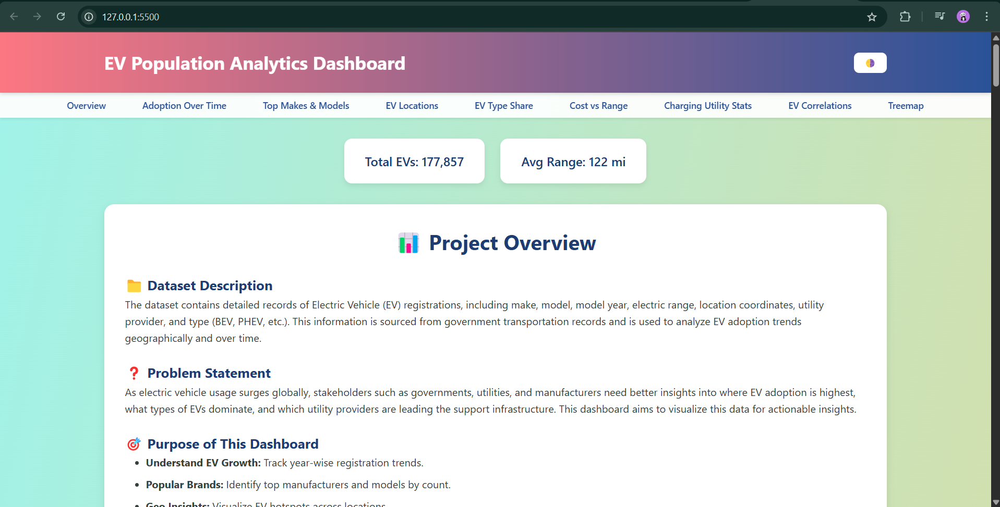
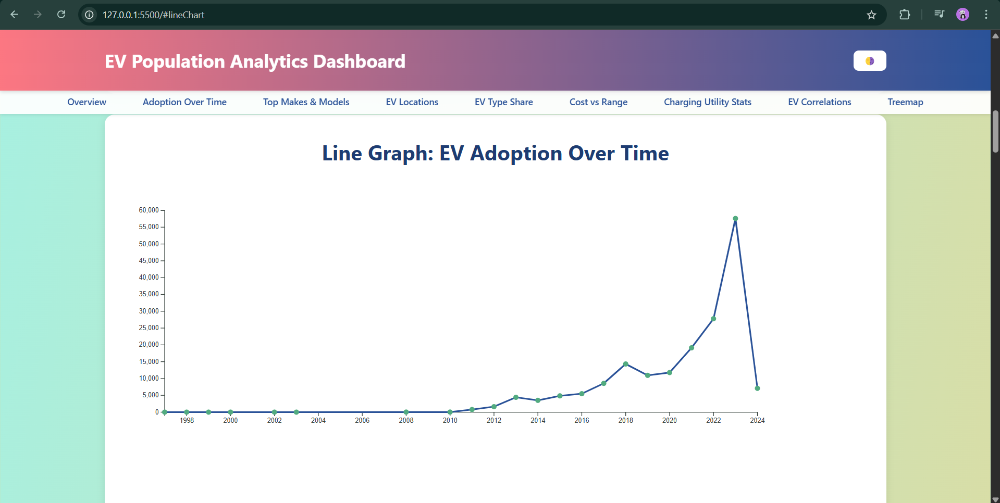
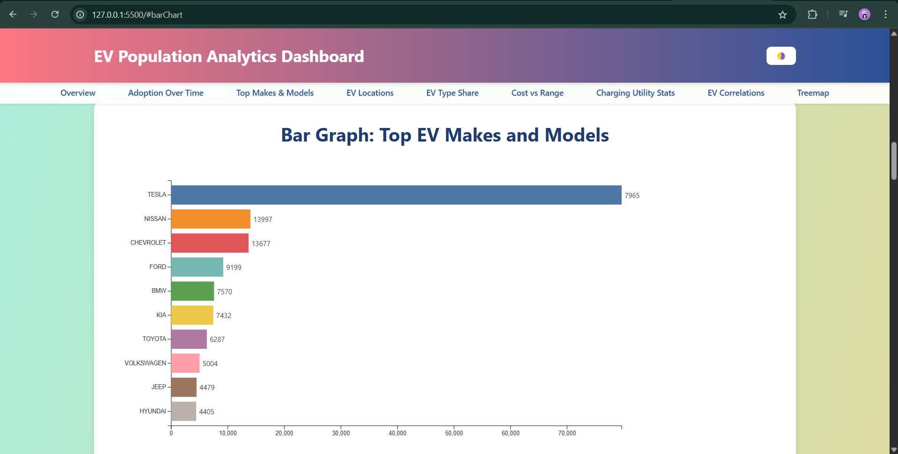
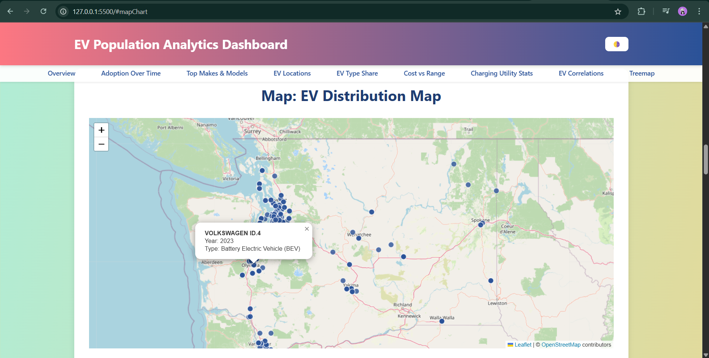
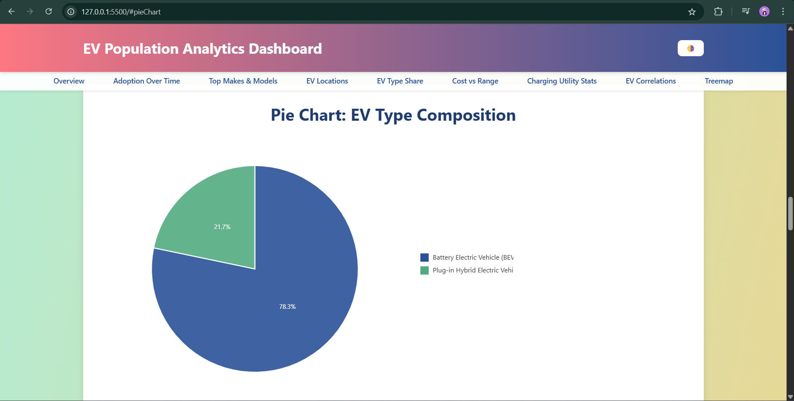
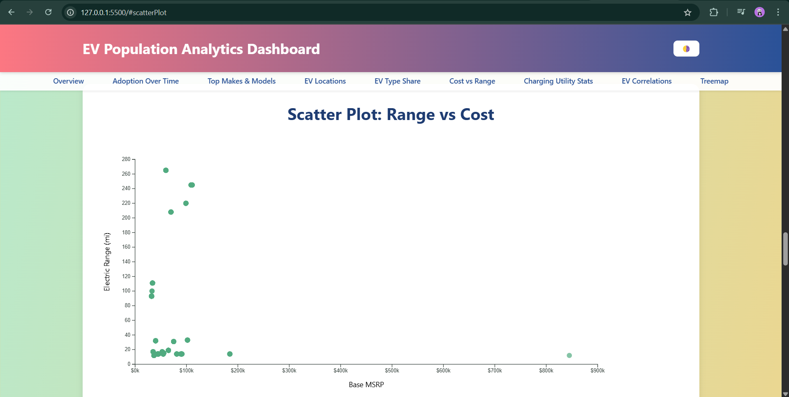
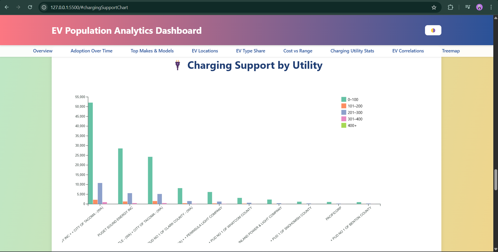
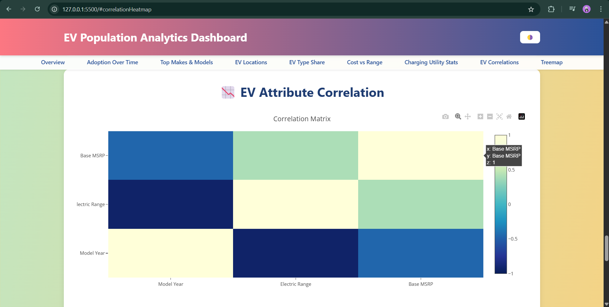
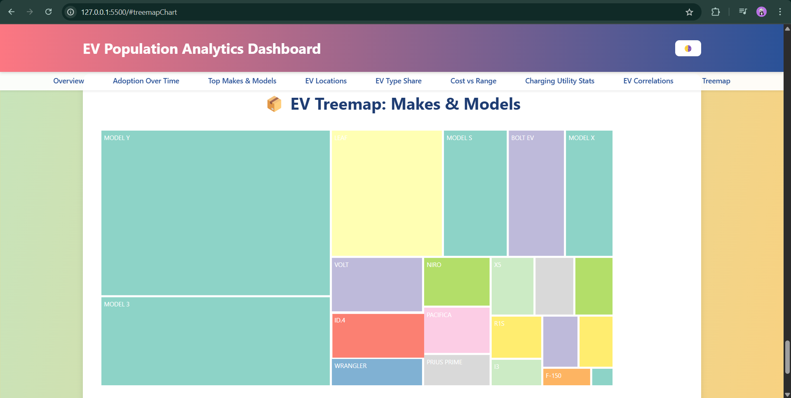

## 🌐 Title of the Work

🚗 Electric Vehicle Population Analytics Dashboard**

---

## 👥 Group Members

- Ajeet Raghuvanshi - 02177952
- Piyush Patil - 02184301
- G RAVIKANTH - 02193073
- Srishti Verma - 02150187

---

## 📅 How to Run the Project

1. **Clone or Download the Project:**
   ```bash
   git clone https://github.com/Patil1707/DV
   ```
2. **Project Structure:**
   ```bash
   /index.html
   /style.css
   /data/ev_population_data.csv
   /js/
     - main.js
     - barChart.js
     - lineChart.js
     - mapChart.js
     - pieChart.js
     - scatterPlot.js
     - chargingSupport.js
     - correlationHeatmap.js
     - treemapChart.js
   /assets/
     - logo.png
     - Line_Graph.png
     - Bar_Graph.png
     - Map.png
     - Pie_Chart.png
     - Scatter_Plot.png
     - Grouped_Bar_Graph.png
     - Heat_Map.png
     - Tree_Map.png
   ```
3. **Start a Local Server:**
   - Open the folder in **VS Code** → Install **Live Server Extension**.
   - Right-click `index.html` → Click **Open with Live Server**.
   
4. **Open Browser:** Visit `http://localhost:5500/` to view the dashboard.

✅ **Important:** Running through a server is necessary because the browser restricts direct CSV loading.

---

## 📊 How to Read the Visualizations

| Chart | Axis and Encoding | Interpretation |
|------|-------------------|-----------------|
| **Line Chart: EV Adoption Over Time** | X-axis: Model Year, Y-axis: Number of EVs | Shows growth in EV adoption year-wise. Sharp rise indicates popularity increase. |
| **Bar Chart: Top Makes** | Y-axis: EV Manufacturer (Make), X-axis: Count | Highlights which brands dominate the EV market. |
| **Map: EV Locations** | Latitude & Longitude (Markers) | Shows geographic hotspots of EV ownership, clustered around urban areas. |
| **Pie Chart: EV Type Composition** | Pie slices: EV Type (BEV, PHEV) | Shows percentage share of battery vs plug-in hybrids in the market. |
| **Scatter Plot: MSRP vs Electric Range** | X-axis: Price ($), Y-axis: Electric Range (miles) | Shows cost-effectiveness. Bottom-right = good value; top-left = costly & less range. |
| **Grouped Bar Chart: Charging Support by Utility** | X-axis: Utility Providers, Y-axis: EV Count, Color: Range Bucket | Shows which utilities support more EVs across different range capabilities. |
| **Correlation Heatmap** | Matrix of Variables | Strength and direction of correlations (-1 to +1) between model year, range, MSRP. |
| **Treemap: Top EV Models** | Box Size: Number of EVs registered | Visualizes popularity of EV models under each make in a nested view. |

---

## 🌈 Visualization Idioms Explained

- **Line Chart (Temporal Trend):**
  - Idiom: Line linking data points ordered in time.
  - Shows year-over-year growth.

- **Bar Chart (Categorical Comparison):**
  - Idiom: Length of bar encodes quantity.
  - Compares brands (makes) by total registrations.

- **Map (Geospatial Encoding):**
  - Idiom: Dot location on geographic space.
  - Each point represents a registered EV at its approximate location.

- **Pie Chart (Part-to-Whole):**
  - Idiom: Angle and area encode proportion.
  - Shows share of EV types (BEV vs PHEV).

- **Scatter Plot (2D Correlation):**
  - Idiom: Position encodes two quantitative variables.
  - Studies relationship between electric range and cost.

- **Grouped Bar Chart (Categorical + Subgroup Comparison):**
  - Idiom: Grouped bars encode counts across categories and subcategories.
  - Analyzes support of utilities across range groups.

- **Heatmap (Matrix View):**
  - Idiom: Color encodes strength of relationship.
  - Displays correlations between features.

- **Treemap (Hierarchical Area Chart):**
  - Idiom: Size of area encodes quantity in a hierarchy.
  - Shows make > model breakdown based on EV counts.

---

## 🖼️ Screenshot of Framework



















# 🚀 Summary

- Built fully client-side using **D3.js**, **Plotly.js**, and **Leaflet.js**.
- Highlights EV adoption patterns, range capabilities, cost effectiveness, and infrastructure support.
- Designed to empower researchers, policy makers, businesses, and consumers with actionable EV insights.

---

> **Built with passion for a greener future! 🌱**

